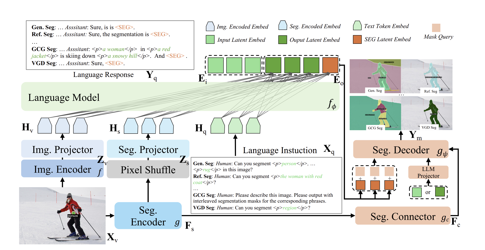
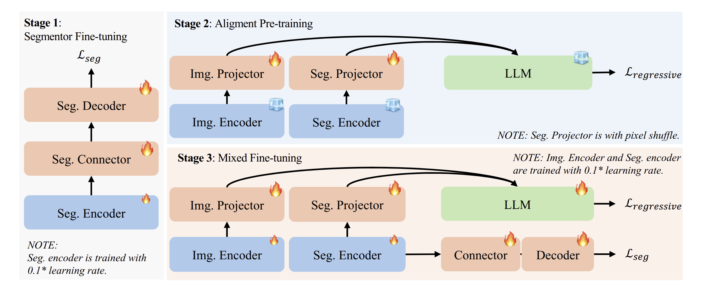

# Jaume Lab PhD Candidate Assignment

**Due date:** 10 days after receiving instructions. Please let me know if you need more time.

---

## Overview

Welcome to the Jaume Lab selection assignment.
This exercise is **open-ended by design**: it tests your ability to think, design, and implement within a modern multimodal AI research framework.

Your task is to **propose and/or implement part of a model and data preparation pipeline** for developing a **zero-shot segmentation and classification model in microscopy imaging**, using **H&E-stained histology** as an example.

### Implementation framing

* There are two ways of which I can think of  it to implement it.

  * An agentic pipeline which has various detection and segmentation tools and using a LLM to call the appropriate tool but it will be difficult to take the full benefit of knowledge in image-text space (interleaved masks) etc.
  * The other method (which I prefer) is using a grounded VLM like Sa2VA,  MVP-LM, Pixel-SAIL etc.
* Closest existing work: SmartPath-R1 uses a Qwen2.5-VL as a VLM and uses different LoRA and adopts a MoE approach to do different tasks. (As Qwen2.5-VL only gives grounded bounding boxes, for segmentation they pass these bounding boxes to MedSAM to do the segmentation).

> What I will like to do in my initial PhD days will be to add moleuclar profiles (like genomics, proteomics) for grounding too. A VLM where vision is not only limited to H&E image but to its proteomics/genomics profile too so that we really have a model which “understands” the WSI.

---

## Background

### H&E Imaging

**Hematoxylin and Eosin (H&E)** staining is the most widely used technique in histopathology to visualize the microscopic architecture of tissues. **Hematoxylin** stains nuclei blue or purple, and **Eosin** stains cytoplasm, connective tissue, and extracellular components pink or red.

Together, they provide morphological contrast that allows pathologists to identify **cell types, tissue organization, and pathological changes** such as inflammation, necrosis, or malignancy.
In computational pathology, H&E images serve as the foundation for developing models that detect, segment, and classify cellular and tissue structures across disease types.

---

### Zero-Shot Segmentation and Classification

**Zero-shot learning** refers to a model’s ability to generalize to **new, unseen classes or tasks** without explicit training examples for them (think like ChatGPT).

* **Zero-shot segmentation** means delineating any structure from text descriptions provided by a user. Aka, no supervised learning anymore, we become fully open-ended.
* **Zero-shot classification** means labeling tissue or cell types based on descriptive prompts rather than fixed training labels.

These models typically rely on **joint vision–language representations** trained on paired data (i.e., images + text captions). When prompted with a new instruction like *“highlight apoptotic bodies”* or *“detect fibrotic areas”*, the model can perform the task by transferring knowledge from semantically related concepts it has already learned.

---

### Instruction Fine-Tuning

**Instruction fine-tuning** is a training strategy where a model (here a multimodal LLM) learns to follow **natural-language instructions** rather than specific labels.

Instead of simple supervision like

> Image → “Tumor”

The model is trained with structured samples like

> Instruction: “Identify and outline the tumor region.”
> Input: Image patch
> Output: Segmentation mask + caption

By exposing the model to many of such examples, the system learns to:

* Interpret diverse phrasing of user requests,
* Perform multimodal reasoning, and
* Produce consistent, interpretable outputs.

---

## 🎯 Objective

Design a **small but meaningful component** of a large system that takes:

* **Input:** a region of interest (ROI) image + a **text instruction** (e.g., *“highlight necrotic regions”*, *“count mitotic figures”*)
* **Output:** a combination of

  * **Segmentation mask** (semantic or instance),
  * **Bounding boxes**,
  * **Accompanying descriptive text.**

You **do not** need to build the full system (this is a 1-year project!), but you must:

1. **Propose a concrete architecture or pipeline** covering the whole concept.
2. **Implement one small component** (e.g., data ingestion, model selection, training loop, evaluation, instruction generation, etc.)
3. **Justify your design choices** (technical rationale, scalability, feasibility).

Assume **compute is unlimited**:

* You can fine-tune a **70B LLM** and a **1B vision model** without a problem.
* You have **unlimited OpenAI API access** to generate synthetic instructions, captions, or QA pairs. Or any other LLMs of your choice.

---

## 🧩 Suggested Directions

You may focus on one or more of the following components:

### 1. Data Ingestion and Preparation

* Identify **existing public segmentation/classification datasets** (e.g., PanNuke, Lizard, NuCLS, CoNSeP, MoNuSeg, etc.).

  * PanNuke
  * Lizard
  * NuCLS
  * CoNSeP
  * MoNuSAC
  * MoNuSeg
  * PanopTILs
  * SegPath etc

* Propose a **pipeline to transform existing annotations** (masks, nuclei, captions, etc.) into instruction–response pairs suitable for **zero-shot training**.

  * Similar to the next question?

* Design a **data generation loop** using LLMs to produce varied and realistic instructions (e.g., “Find mitotic figures” → segmentation mask + caption).

  * Using the existing image-caption pairs, Visual Question Answer pairs, Reasoning datasets, under a for loop we use a LLM to detect object/stuff in the text and using models like BioMedParse to generate corresponding masks. Then we modify the text to add tokens (if not present) like `<p>`, `</p>`, `<SEG>`, `<think>`, `<image>` etc (Specialized tokens are used to convey to VLM the underlying task) and arrange them so that it can be used by the dataset class and thus to train the VLM...

* Think about guardrails! E.g., what if a user asks to count the hepatocytes (liver cells), but the tissue is actually kidney? The output should likely look like: "This appears to be kidney tissue, are you sure this is a liver image?"

  * [Kolmogorov–Smirnov (K–S)](https://www.tandfonline.com/doi/abs/10.1080/01621459.1951.10500769) test used in [BiomedParse](https://www.nature.com/articles/s41592-024-02499-w.epdf?sharing_token=13MXNEG8f5JOr30TorWJXNRgN0jAjWel9jnR3ZoTv0PZugrLJtTZcQj4PJckxX_PaGqvO3y6jPvaAlFxqlfW8F1tqAukjnPV-aqr4s4izWg_qebtOm7qbi6Z08lkjqQOOaSe7JB9tCb23TCY3OrElyRUhgGtiROQd3xy4AwyZIsjw-5m2Cx8bag044uNrqQHwSazsFcyeiEYlaP6lqewuQu0xEd5yA0CQhB-2umuHSM%3D)

  * Chain of Thought prompt:
  
    > Just an example:
    > **Your Task:** Before you execute any request, you must first verify its underlying assumptions. Use this general chain of thought:
    >
    > 1. **Analyze the Request:**\
    >        a. What is the user's primary goal?\
    >        b. What key assumption must be true about the provided input for this request to be valid?\
    > 2. **Analyze the Input:**\
    >        a. Examine the input data independently.\
    >        b. What are its actual properties, content, or context?\
    > 3. **Compare and Verify:**\
    >        a. Does your independent analysis of the input (from Step 2) match the user's core assumption (from Step 1)?\
    > 4. **Formulate a Response:**\
    >        a. If they match, proceed with the user's original request.\
    >        b. If they do NOT match, do not proceed. Instead, clearly state the discrepancy you found and ask the user for clarification.\

* Discuss how to **maximize diversity** across tissue types and diseases.

  * Defining diversity upfront: Organ, Site, Tumor subtype, Grade, stage, Resection, Biopsy, Scanner model, magnifications, Age, Sexes etc
  * These variables define the target sampling frame and the strata for enrollment and data acquisition.

---

### 2. Modeling Strategy

* Propose a **joint model** (vision–language transformer, or instruction-tuned LLM+ViT hybrid).

<table>
  <thead>
    <tr>
      <th rowspan="2">Model</th>
      <th colspan="3">RefCOCO</th>
      <th colspan="3">RefCOCO+</th>
      <th colspan="2">RefCOCOg</th>
    </tr>
    <tr>
      <th>val</th><th>testA</th><th>testB</th>
      <th>val</th><th>testA</th><th>testB</th>
      <th>val</th><th>test</th>
    </tr>
  </thead>
  <tbody>
    <tr>
      <td>Sa2VA 8B</td>
      <td colspan="3" align="center"><b>81.6</b></td>
      <td colspan="3" align="center"><b>76.2</b></td>
      <td colspan="2" align="center"><b>78.7</b></td>
    </tr>
    <tr>
      <td>MVP-LM</td>
      <td align="right">83.6</td><td align="right">85.1</td><td align="right">82.5</td>
      <td align="right">73.9</td><td align="right">76.8</td><td align="right">65.4</td>
      <td align="right">75.1</td><td align="right">75.6</td>
    </tr>
    <tr>
      <td>Pixel-SAIL (ft) 3B</td>
      <td align="right">81.8</td><td align="right">83.4</td><td align="right">78.8</td>
      <td align="right">76.2</td><td align="right">79.7</td><td align="right">71.2</td>
      <td align="right">78.5</td><td align="right">79.4</td>
    </tr>
    <tr>
      <td>UFO</td>
      <td align="right">81.0</td><td align="right">82.6</td><td align="right">78.6</td>
      <td align="right">77.1</td><td align="right">80.4</td><td align="right">72.6</td>
      <td align="right">76.7</td><td align="right">77.3</td>
    </tr>
    <tr>
      <td>Segment Anyword</td>
      <td align="right">55.32</td><td align="right">47.87</td><td align="right">66.04</td>
      <td align="right">55.57</td><td align="right">47.43</td><td align="right">67.04</td>
      <td align="right">58.43</td><td align="right">60.09</td>
    </tr>
    <tr>
      <td>X-SAM</td>
      <td align="right">85.1</td><td align="right">87.1</td><td align="right">83.4</td>
      <td align="right">78.0</td><td align="right">81.0</td><td align="right">74.4</td>
      <td align="right">83.8</td><td align="right">83.9</td>
    </tr>
  </tbody>
</table>

There are many models (search the new SOTAs in ICLR 2026) which are dense grounded VLMs with ever growing new additional tasks (Visual Grounded (VGD) segmentation, which segments all instance objects with interactive visual prompts in an image in X-SAM), lets take the example of X-SAM:



* Discuss **transfer learning** and how to leverage pretrained biomedical or general models.

  * For example, in X-SAM, SigLIP2-so400m is used as image encoder we can use a pretrained FM like UNI etc to initialize weights

* Suggest training objectives (contrastive loss, segmentation loss, caption loss, instruction tuning).

  * X-SAM:

    **Stage 1: Segmentor Fine-tuning**

    ```math
    \mathcal{L}_{\mathrm{seg}}
    = \mathcal{L}_{\mathrm{cls}} + \mathcal{L}_{\mathrm{mask}} + \mathcal{L}_{\mathrm{dice}}
    ```

    **Stage 2: Alignment Pre-training**

    ```math
    \mathcal{L}_{\text{regressive}}
    = - \sum_{i=1}^{N} \log p_{\theta}\!\left(
    \mathcal{Y}_{q}^{[P+i]} \,\middle|\, \mathcal{Y}_{q}^{[:\,i-1]},\, \mathcal{X}_{q}^{[:\,i-1]}
    \right)
    ```

    **Stage 3: Mixed Fine-tuning**

    ```math
    \mathcal{L}_{\mathrm{total}} =
    \begin{cases}
    \mathcal{L}_{\mathrm{regressive}}, & \text{conversation},\\[2pt]
    \mathcal{L}_{\mathrm{regressive}} + \mathcal{L}_{\mathrm{seg}}, & \text{segmentation}.
    \end{cases}
    ```


* Suggest ways to generate the segmentation output. How are SegmentAnything, BioMedParse, etc., doing this task?

  * Using image-caption pair datasets (QUILT, PATHCAP etc), using a LLM detect all the objects (Lymphocyte, Tumor Cells etc), stuff (Stroma etc) in those captions and using these objects/stuff generate masks via BioMedParse...

---

### 3. Implementation Component

Choose one small but technically interesting piece to implement, for example:

* Dataset loader and instruction generator.
* Vision encoder fine-tuning script.
* Prompt-to-segmentation proof of concept using a pretrained SAM/CLIP/DINO model.
* LLM-based instruction expansion pipeline.
* It can be any component that you feel most comfortable implementing. Being small is not a problem, but it has to be justified and clean.

---

## 📚 References

You could take inspiration from the following foundational works:

* [**A foundation model for joint segmentation, detection and recognition of biomedical objects across nine modalities**](https://www.nature.com/articles/s41592-024-02499-w)
* [**A multimodal generative AI copilot for human pathology**](https://www.nature.com/articles/s41586-024-07618-3)

---

## 🧮 Evaluation Criteria

Your submission will be evaluated on:

| Criterion                  | Description                                                                  |
| -------------------------- | ---------------------------------------------------------------------------- |
| **Originality**            | Novel, clear, and well-motivated approach                                    |
| **Technical Depth**        | Understanding of multimodal learning and data engineering                    |
| **Implementation Quality** | Clean, reproducible code for the selected component                          |
| **Scalability Thinking**   | How easily your approach can scale to large datasets and multiple modalities |
| **Clarity**                | Well-structured explanation and justification                                |

---

## ⚙️ Practical Details

* **Submission:**
  Fork this repository and submit your project as a **private GitHub repo** with `guillaumejaume` as a collaborator.

* **Structure:**

  ```
  ├── README.md # Main description (this file)
  ├── data/ # Example data or links
  ├── src/ # Code for your component
  ├── notebooks/ # Optional exploratory notebooks
  ├── results/ # Optional visualizations
  └── references/ # Additional papers, diagrams, or notes
  ```

* **Language:** Python (preferably with PyTorch)

* **Tools:** You are encouraged to use **ChatGPT, Cursor, or similar tools** to accelerate prototyping.

---

## Final Thought

This is not a test of your ability to finish—there is WAY too much work. It's a test of how you **think and approach a complex problem**.
Show curiosity, ambition, and clarity.
Surprise us.

— *Jaume Lab*
Department of Oncology, CHUV/UNIL
